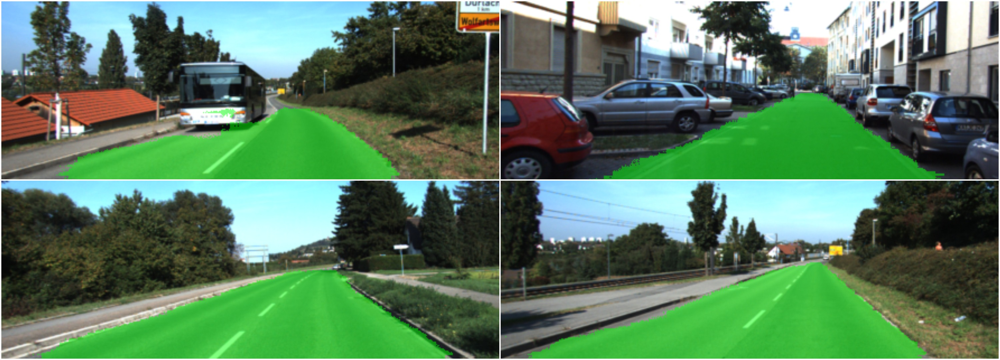
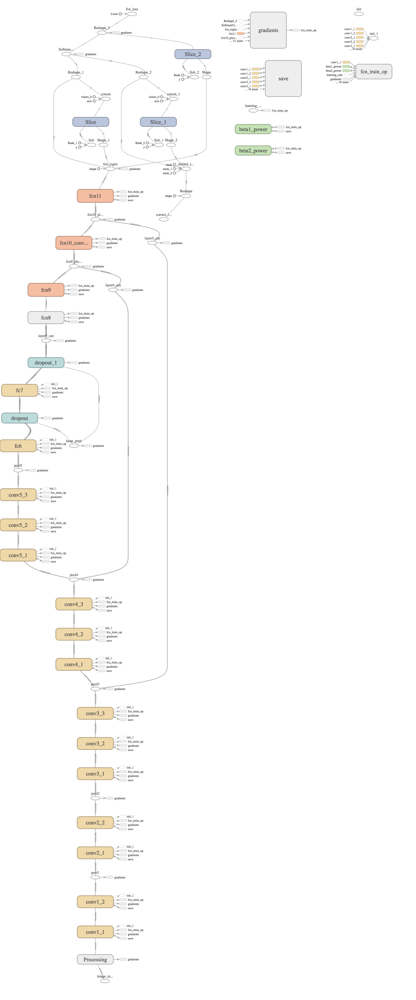

# Semantic Segmentation
### Introduction
The goal of this project was to label the pixels of a road in images/videos using a Fully Convolutional Network (FCN). Network was trained on [Kitti Road dataset](http://www.cvlibs.net/datasets/kitti/eval_road.php)

**Images**



**Video**


### FCN Architecture

FCN archicture is based on FCN-8s.

- **Encoder:** A pretrained `VGG16` has been used as an encoder and decoder part start from `layer-7 of VGG16`. _So first 7 layers of this FCN are of VGG16_.
- **FCN Layer-8:** Last fully connected layer of VGG16 have been replaced by 1x1 convolution.
- **FCN Layer-9:** `FCN Layer-8` has been upsampled 2x times to match dimensions with `VGG layer-4`, using transposed convolution with parameters: (kernel=(4,4), stride=(2,2), paddding='same'). After that a skip connection was added between `VGG layer-4` and `FCN layer-9`.
- **FCN Layer-10:** `Layer-9` has been upsampled 2x times to match dimensions with `VGG layer-3`, using transposed convolution with parameters: (kernel=(4,4), stride=(2,2), paddding='same'). After that a skip connection was added between `VGG layer-3` and `FCN layer-10`.
- **FCN Layer-11:** `Layer-10` has been upsampled 4x times to match dimensions with input image size so we get the actual image back and depth is equal to `number of classes`, using transposed convolution with parameters: (kernel=(16,16), stride=(8,8), paddding='same').

Below is a graph of this FCN. 



### Hyperparameters and Loss Function

Optimizer used was [Adam Optimizer](https://www.tensorflow.org/api_docs/python/tf/train/AdamOptimizer) with `softmax and cross entropy` loss function. Following parameters were used.

```
learning_rate = 0.001
keep_probability = 0.5
batch size = 16 (due to memory constraints of GPU)
Epochs = 40
num_classes = 2
image_shape = (160, 576)
```

Model was run using 3 different epochs count with following results for each.

```
EPOCH 10 ...
Loss = 2.518

EPOCH 20 ...
Loss = 2.365

EPOCH 40 ...
Loss = 1.764
```

Results improved as epoch count was increased. Test images results for each epoch count can be found in `runs/epoch-*/` directory. Video results for epochs=20 and epochs-40 are also included in repo.

### Setup
##### Frameworks and Packages
Make sure you have the following is installed:

 - [Python 3](https://www.python.org/)
 - [TensorFlow](https://www.tensorflow.org/)
 - [NumPy](http://www.numpy.org/)
 - [SciPy](https://www.scipy.org/)
 
##### Dataset
Download the [Kitti Road dataset](http://www.cvlibs.net/datasets/kitti/eval_road.php) from [here](http://www.cvlibs.net/download.php?file=data_road.zip).  Extract the dataset in the `data` folder.  This will create the folder `data_road` with all the training a test images.

### Start
- `main.py` file contains the code for training. For training, run the following command. After successful training, a model will be saved to `saved_model` and test images will be written to `runs/*/` dir.

	```
	python main.py
	```
- If the model is already trained, in that case run the following command to test it on testing images or testing video.
	
	```
	python run_saved_model.py [video|images|both]
	```
	
**Note** If running this in Jupyter Notebook system messages, such as those regarding test status, may appear in the terminal rather than the notebook.

## Meta

Ramiz Raja – [informramiz@gmail.com](informramiz@gmail.com)

Distributed under the Apache license. See ``LICENSE`` for more information.

[https://github.com/informramiz](https://github.com/informramiz/)


### Contributing

1. Fork it (<https://github.com/informramiz/Road-Semantic-Segmentation/fork>)
2. Create your feature branch (`git checkout -b feature/fooBar`)
3. Commit your changes (`git commit -am 'Add some fooBar'`)
4. Push to the branch (`git push origin feature/fooBar`)
5. Create a new Pull Request

